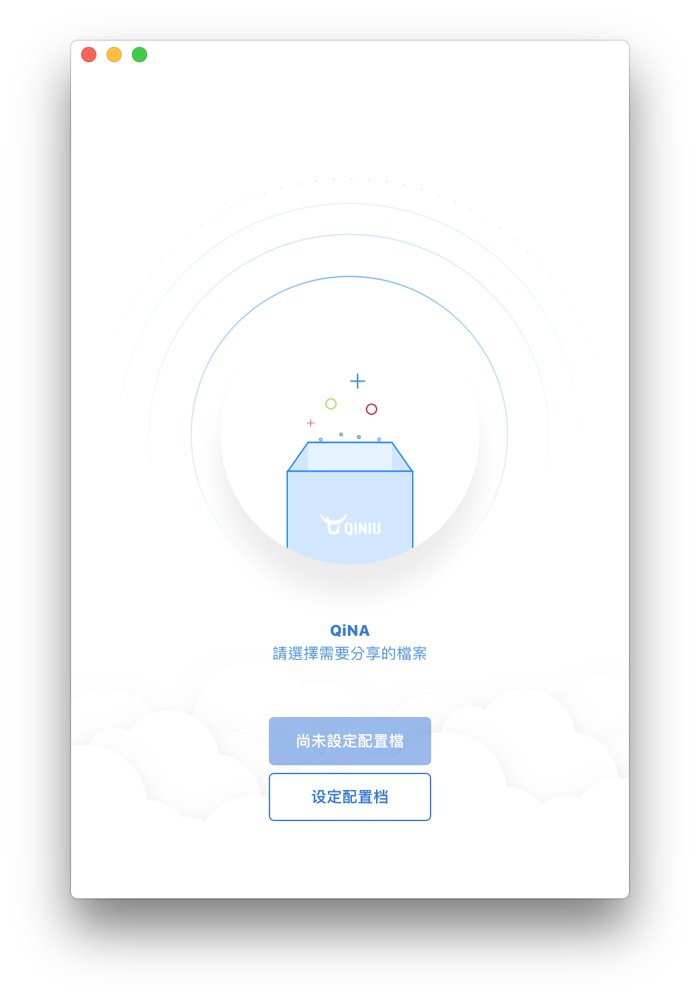

# QiNA

[](http://forthebadge.com)
[](http://forthebadge.com)
[](http://forthebadge.com)
[](http://forthebadge.com)

> 基於 vue-electron 開發。


一個七牛 CDN Nodejs GUI 封裝。


# 視頻展示

https://www.youtube.com/watch?v=JiZosmVATW0


## 發佈版下載

https://github.com/qoli/QiNA/releases/


## 更新日誌

##### 2020年06月22日

##### 修正

* README 文檔的視頻展示地址修改

##### 合併源碼 感謝 xiamu14 的提交

1. 优化图片名称，去掉 () , 部分markdown 编辑器无法识别 图片地址里的 ()。
2. 优化图片名称，增加自定义 tag 前缀，方便检索图片。
3. 增加”复制按钮“，一键复制图片链接。


##### 2018年09月28日 · 0.0.5 版本

##### 添加

* 顯示上傳進度

##### 修正

* 從 qn 庫轉移為 七牛官方 SDK
* 修正 `npm run dev` 問題
* 符合 eslint
* 修正 Mac 圖標陰影（設計稿不見了，所以簡單做了一個）


##### 2017年01月26日．0.0.4 版本

##### 添加

* 文件拖放上傳加入。
* 添加開源項目列表。

##### 修正

* 因代碼錯誤而無法點擊的中央大圓圈。
* 分離部分 css。


##### 2017年01月26日．之前

* 0.0.3 版本．發佈


## TODO

- [x] 添加文件拖入上傳的支持。
- [x] 修正設定面板無法複製粘貼的問題。
- [x] 修正發佈版本會多開的問題。
- [ ] 郵件內使用的分享樣式。
- [ ] 下載文件的 Web 分享頁面。
- [ ] 中斷按鈕不可靠。


## Screen



## Build Setup

``` bash
# install dependencies
npm install

# serve with hot reload at localhost:9080
npm run dev

# build electron app for production
npm run build
# 目前只設定了 macOS

# lint all JS/Vue component files in `app/src`
npm run lint

# run webpack in production
npm run pack
```
More information can be found [here](https://simulatedgreg.gitbooks.io/electron-vue/content/docs/npm_scripts.html).

---

This project was generated from [electron-vue](https://github.com/SimulatedGREG/electron-vue) using [vue-cli](https://github.com/vuejs/vue-cli). Documentation about this project can be found [here](https://simulatedgreg.gitbooks.io/electron-vue/content/index.html).
