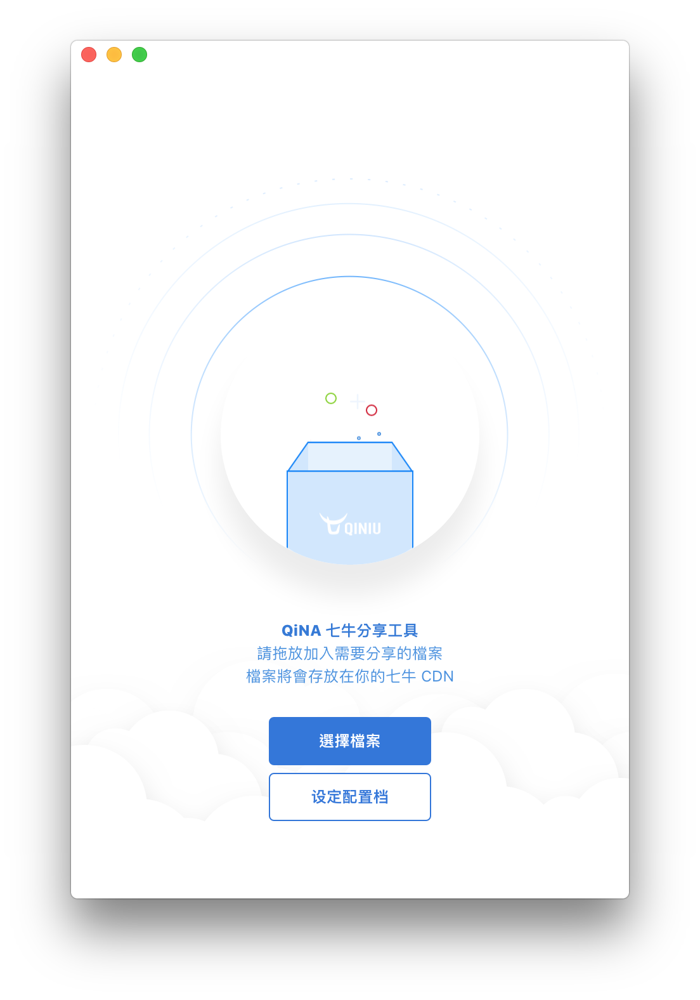

# QiNA

> 一個七牛 CDN Nodejs GUI 封裝

基於 vue-electron 開發。



## Build Setup

``` bash
# install dependencies
npm install

# serve with hot reload at localhost:9080
npm run dev

# build electron app for production
npm run build
npm run build:darwin # builds for darwin (macOS)

# lint all JS/Vue component files in `app/src`
npm run lint

# run webpack in production
npm run pack
```
More information can be found [here](https://simulatedgreg.gitbooks.io/electron-vue/content/docs/npm_scripts.html).

---

This project was generated from [electron-vue](https://github.com/SimulatedGREG/electron-vue) using [vue-cli](https://github.com/vuejs/vue-cli). Documentation about this project can be found [here](https://simulatedgreg.gitbooks.io/electron-vue/content/index.html).
